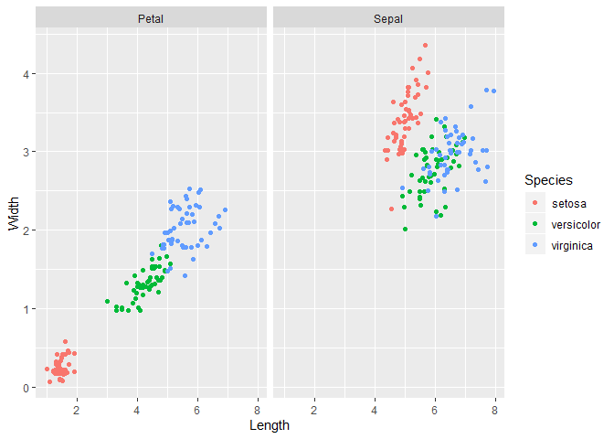

# Data Exploration

Before building the classifier, it can be constructive to explore and
visualize the
    data.

``` r
library(tidyverse)
```

    ## -- Attaching packages -------------------------------------------------------------- tidyverse 1.2.1 --

    ## v ggplot2 3.2.0     v purrr   0.3.2
    ## v tibble  2.1.3     v dplyr   0.8.3
    ## v tidyr   0.8.3     v stringr 1.4.0
    ## v readr   1.3.1     v forcats 0.4.0

    ## -- Conflicts ----------------------------------------------------------------- tidyverse_conflicts() --
    ## x dplyr::filter() masks stats::filter()
    ## x dplyr::lag()    masks stats::lag()

## Dataset

Using the classic Iris Dataset

``` r
df <- as_tibble(iris)
str(df)
```

    ## Classes 'tbl_df', 'tbl' and 'data.frame':    150 obs. of  5 variables:
    ##  $ Sepal.Length: num  5.1 4.9 4.7 4.6 5 5.4 4.6 5 4.4 4.9 ...
    ##  $ Sepal.Width : num  3.5 3 3.2 3.1 3.6 3.9 3.4 3.4 2.9 3.1 ...
    ##  $ Petal.Length: num  1.4 1.4 1.3 1.5 1.4 1.7 1.4 1.5 1.4 1.5 ...
    ##  $ Petal.Width : num  0.2 0.2 0.2 0.2 0.2 0.4 0.3 0.2 0.2 0.1 ...
    ##  $ Species     : Factor w/ 3 levels "setosa","versicolor",..: 1 1 1 1 1 1 1 1 1 1 ...

``` r
head(df)
```

    ## # A tibble: 6 x 5
    ##   Sepal.Length Sepal.Width Petal.Length Petal.Width Species
    ##          <dbl>       <dbl>        <dbl>       <dbl> <fct>  
    ## 1          5.1         3.5          1.4         0.2 setosa 
    ## 2          4.9         3            1.4         0.2 setosa 
    ## 3          4.7         3.2          1.3         0.2 setosa 
    ## 4          4.6         3.1          1.5         0.2 setosa 
    ## 5          5           3.6          1.4         0.2 setosa 
    ## 6          5.4         3.9          1.7         0.4 setosa

## Basic EDA

Prepare three dataframes

  - df contains information for each flower
  - df\_long contains information for each measurement
  - df\_wide contains information for each part

<!-- end list -->

``` r
df_long <- df %>% 
    gather(key = Part_Measure, value = Value, -Species) %>% #Gather columns
    separate(col = Part_Measure, into = c("Part", "Measure"), sep = "\\.") #Break gathered column into two columns
df_long$Measure <- as.factor(df_long$Measure)
head(df_long)
```

    ## # A tibble: 6 x 4
    ##   Species Part  Measure Value
    ##   <fct>   <chr> <fct>   <dbl>
    ## 1 setosa  Sepal Length    5.1
    ## 2 setosa  Sepal Length    4.9
    ## 3 setosa  Sepal Length    4.7
    ## 4 setosa  Sepal Length    4.6
    ## 5 setosa  Sepal Length    5  
    ## 6 setosa  Sepal Length    5.4

``` r
df$FlowerID <- 1:nrow(df)
df_wide <- df %>% 
    gather(key = Part_Measure, value = Value, -Species, -FlowerID) %>% 
    separate(col = Part_Measure, into = c("Part", "Measure"), sep = "\\.") %>% 
    spread(key = Measure, value = Value)
head(df_wide)
```

    ## # A tibble: 6 x 5
    ##   Species FlowerID Part  Length Width
    ##   <fct>      <int> <chr>  <dbl> <dbl>
    ## 1 setosa         1 Petal    1.4   0.2
    ## 2 setosa         1 Sepal    5.1   3.5
    ## 3 setosa         2 Petal    1.4   0.2
    ## 4 setosa         2 Sepal    4.9   3  
    ## 5 setosa         3 Petal    1.3   0.2
    ## 6 setosa         3 Sepal    4.7   3.2

Q: How do measurements compare between species?

``` r
ggplot(df_long, aes(x = Species, y = Value, col = Part)) +
    geom_jitter()+
    facet_grid(. ~ Measure)
```

<!-- -->

Right away, we can see that the Setosa is distinct from the other two
species, especially by Petal. The sepal measurements between the
Versicolor and Virginica species appear similar, especially for width Q:
How does length and width of each part relate for each species?

``` r
ggplot(df_wide, aes(x = Length, y = Width, col = Part)) +
    geom_jitter() +
    facet_grid(. ~ Species)
```

<!-- -->

Q: How do the species compare to each other?

``` r
ggplot(df_wide, aes(x=Length, y = Width, col = Species)) +
    geom_jitter() +
    facet_grid(. ~ Part)
```

<!-- -->

Petal measurements are distinct between each species. Sepal widths of
Virginica and Versicolor overlap but values of length vary.

Wonderings: - can a simple neural network be trained to distinguish
flower species?

Answer: - Definitely, although mileage may vary.
